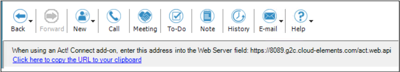
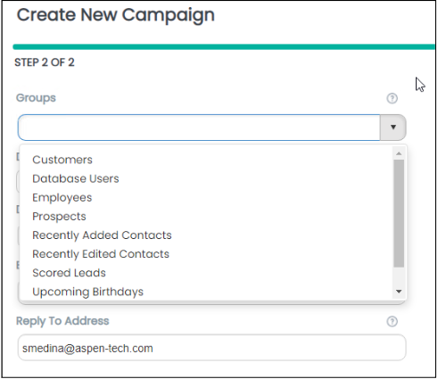
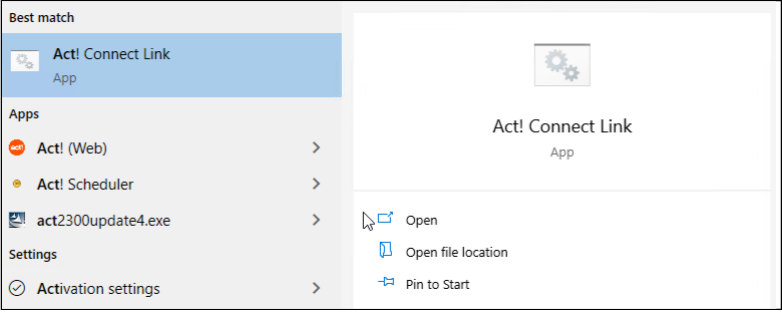
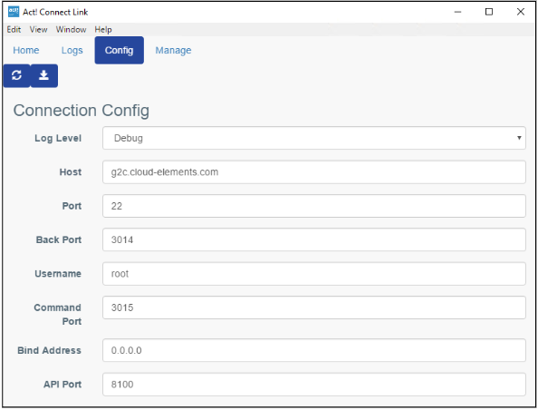
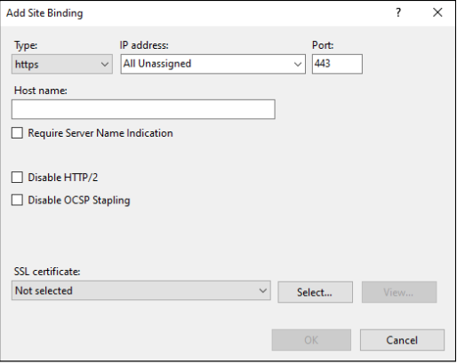
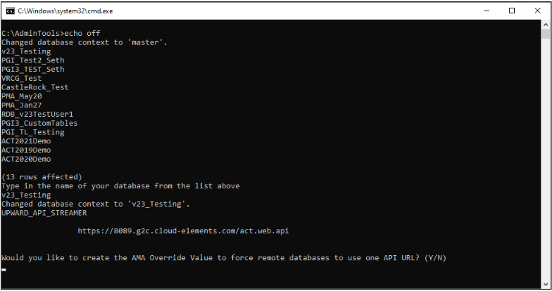

# SOP

## Installing and Configuring the Act! Web API Database Connection

### Overview
When a client has requested to have the Act! Web API configured for use with Act! Marketing Automation, Act!
Premium accessed via web, or 3rd-party connections, you will need to create a secure connection from their Act! database to the cloud API endpoint.

You have two options for creating this connection for an Act! database:

* Installing the Act! Connect Link software on the client's server or machine hosting the Act! database
* Installing Act! Premium for Web on the client's server / host machine and then installing and configuring an SSL
certificate on that same machine

This document helps the Act! consultant understand how to achieve both of these configurations.

!!! note
        The API connections for the Microsoft Outlook and Word add-ins (v22.1+) use a local service and do not
        require the endpoint to be configured to work properly. However, users do need to have the Web API Access
        permission added to their permissions in the Tools > Manage Users menu.

### The differences between Act! Connect Link and an SSL certificate
Things to consider when deciding which method to use:

* Act! Connect Link is easier to configure, as you simply install a piece of software and open any necessary firewall
ports.
* Using an SSL certificate requires more work to configure, as you need to obtain and then install the certificate
before you can set the API endpoint URL using the appropriate batch file.
* Both options can be used in conjunction with Act! Premium (Web) to set up web access to an Act! database.
* Act! Support officially does not recommend nor support Act! Premium for Web configurations using Act! Connect
Link to create an API endpoint URL (only recommended for use with non-web Act! Premium).
* SSL certificate configurations tend to be more stable and provide smoother functionality across services that
require the API endpoint connection (especially when dealing with databases that are large or have large data sets).

### Installing and configuring Act! Connect Link
Installing Act! Connect Link on a client's machine will create a secure ground-to-cloud connection from that machine
to the cloud server being hosted by the company providing this service.

To install Connect Link:

1. Download the installer from the [Act! website](https://www.act.com/products/act-connect-link) and run the .exe file, accepting all of the default
options.

2. Once installed, a unique URL is generated for use as the database's API endpoint.

3. To view the unique URL that has been generated, open the Act! software.

4. Click the Act! Connect button in the column of options seen in the lower-left corner of the program window.

5. If the connection is working properly, you will see the URL displayed along the top of the program window.

6. Copy this link to your clipboard using the button under the URL (optional).

!!! note
        The API URL should be updated in the configuration file in the Act! program folders automatically,
        but occasionally it does not get set properly. If this happens, you will need to use the GetSetCloudAPIURL.bat file
        found in the JWT token error KB article to set the value manually.

#### Using ConnectLink with APFW

* If the machine you have installed Connect Link on is using Act! Premium for Web, ensure the **Website Administration** settings have all been configured and tested successfully. 
        * You can find these settings in **Tools > Website Administration...**

* To test a successful API connection to the Act! database, copy and paste the API URL into a web browser. If the connection is working properly, the Act! Web API Documentation webpage will display. 
        * If the client is using Act! Marketing Automation, you can also attempt to open the AMA module in Act!.

* To verify a successful connection for clients to see:
        * Create a blank test campaign in AMA and attempt to select an Act! Group for the campaign.
        * If the groups in the database appear for selection, you have a working API connection.

#### Troubleshooting the Act! Connect Link connection
The Connect Link software operates over Port 80 (http), which is typically blocked by most organizations.

You can find a list of other ports to try opening if the connection issues persist by opening the Connect Link menu.

1. To open the Connect Link menu, click the Windows Start button and search for "Act!".

        

2. Click the Act! Connect Link option to launch the interface.

3. Click the Config tab to view the different Connect Link settings / ports.

#### Uninstalling / reinstalling Connect Link
If opening these ports for the Connect Link software does not help resolve your connection problems, the next step is
to try uninstalling and reinstalling the software.
Open the installed programs list for the machine in question and uninstall the Connect Link software.
Once the uninstall process finishes, navigate to the C: drive and delete the ActConnectLink folder.
Then, reinstall the Connect Link software by running the installer file again.
This will create a new endpoint / tenant for the Act! database and can help resolve some connectivity issues.
Because this changes the API URL value, you may need to update the API URL for the database using the
GetSetCloudAPIURL.bat file in the JWT token error [KB article](https://help.act.com/hc/en-us/articles/360024432273-Error-Invalid-JWT-Token-when-accessing-Act-Marketing-Automation).

!!! note
        Uninstalling & reinstalling Connect Link will create a new Connect Link API web address. If a client is using
        Connect Link for connections other than AMA (Act! Companion Mobile App, Zapier.com, etc.), they will need to be
        notified to update their login credentials URL in those other programs.

### Configuring the API URL endpoint via SSL certificate
If the client wants a customized web URL when accessing their Act! database via web or wants the stability benefits
of using the SSL certificate configuration instead of Connect Link, then an SSL certificate will need to be purchased
and installed on the machine hosting the Act! database.
Typically AspenTech Act! support agents do not handle obtaining or installing the SSL certificate directly.
Have the client's IT vendor / contact handle the installation of the SSL certificate and once it has been installed the
support agent will be able to configure the API endpoint for the Act! database.

!!! note
        An SSL certificate configuration requires Act! Premium for Web be installed on the host machine, along with
        the completion of all Website Administration settings in Tools > Website Administration.

Before the SSL certificate is purchased, discuss with the client their desired domain name URL for their Act! website /
API endpoint.
Typically this is something like marketing.companymame.com or act.companyname.com, but can be whatever
the client desires to an extent.
This information will need to be provided to the IT vendor / contact so they can purchase an SSL certificate with the
proper domain name.

#### Configuring IIS once the SSL certificate has been installed
Once IT has installed the SSL certificate on the host machine, you are ready to configure the API endpoint URL.
First, make sure the certificate is bound to the https port (443) in the IIS menu.
To open the IIS menu, click the Windows Start button and type "IIS".
Click on Internet Information Services (IIS) Manager to launch the interface.

!!! note
        Do not click on Internet Information Services (IIS) 6.0 Manager.

In the Connections pane located in the left-hand column, expand each line until Default Website becomes visible.
Click on Default Website to select it.
Then, in the Actions pane in the right-hand column, click Bindings under Edit Site.
If there is no https binding added, click the Add... button to create a new site binding.
Click the Type dropdown button and choose https.
Then click the SSL certificate dropdown to select the appropriate SSL certificate that was installed by IT.
You should not need to change any other values for this binding if the SSL certificate was installed properly.
If you do not see the SSL certificate in the dropdown menu for selection, it is likely the SSL certificate was not
installed properly.

After the SSL certificate has been added to the site binding, we need to set the API URL value in the database web
configuration file.

#### Setting the API URL value in the web configuration file
A web configuration file is used to tell the database which URL should be used for the API endpoint connection.
We want the database to use the newly installed SSL certificate / domain.
Download the GetSetCloudAPIURL.bat file from the JWT token error [KB article](https://help.act.com/hc/en-us/articles/360024432273-Error-Invalid-JWT-Token-when-accessing-Act-Marketing-Automation).
Once downloaded, run this file and proceed through the Command Prompt tasks.
First, type in the name of the database exactly as it appears in the list in the Command Prompt window to select it.
You are then asked if you want to update the API URL value for this database.

Type Y for "yes" and hit enter. Or type N for "no" if you chose the wrong database.
Copy and paste (or type in) the full API URL that has been configured with the SSL certificate, including the
/act.web.api pathing:
https://actweb.mycompany.com/act.web.api
Hit Enter on your keyboard once the URL has been entered into the Command Prompt properly.
The Command Prompt will return a message confirming the change to the configuration value.
Exit the Command Prompt.

#### Testing / verifying the SSL certificate
Open a web browser and navigate to the domain URL that was configured with the SSL certificate.
To test APFW functionality, add /apfw to the end of the URL:
https://actweb.companyname.com/apfw
To test the web API connection, add /act.web.api to the end of the URL:
https://actweb.companyname.com/act.web.api
The URL with /apfw in its path should open a webpage where you can log into the Act! database using Act! user
credentials.
The URL with /act.web.api in its path will open a webpage displaying the Act! web API help documentation.
If either of these pages do not load as you expect them to, there is likely something in the firewall blocking the
connections.
We can test our Act! configuration by utilizing the local file directories that have been configured in IIS.
Open a web browser and browse to these two URLs:
localhost/apfw
localhost/act.web.api
If the Website Administration tasks have been configured successfully, these two options will return the expected
webpages: the login for the Act! database and the Act! web API help documentation page.
If the local sites load properly, but the domain sites (using the SSL certificate) do not, then something is being
blocked regarding the SSL certificate domain or https port (443).
If the local sites do not load properly, your Act! Website Administration configuration may be misconfigured
somewhere, or the firewall is blocking portions of the Act! application from running properly.

### Adding Act! Web API to a Act! Premium (non-web) installation
If the client's server / host machine is not using Act! Premium for Web (APFW), you will not be able to run an SSL
certificate configuration for API connectivity.
In order to successfully bind an SSL certificate to an Act! database, you need to install Act! Premium for Web. The
APFW installation process creates the necessary virtual directories in IIS that are used with an SSL certificate.
Clients can still create an API connection for their non-web Act! database by installing and configuring the Act!
Connect Link software on the server / host machine.